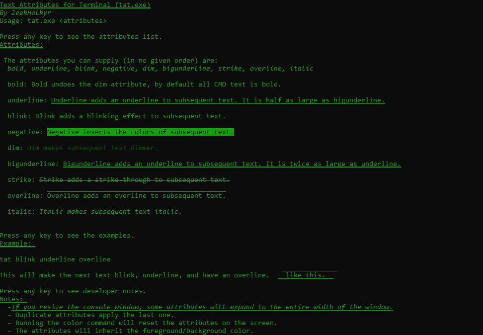

# tat2 - Text Attributes for Terminal
### By ZeekHalkyr

This plugin unlocks some ANSI Escape Sequences in a easy to use format for batch programs.

## Usage

```tat <attributes>```

To reset the screen (wipe all attributes):

```tat reset```

## Attributes and their behavior.
Attributes can be supplied in any order and are separated by spaces. If you call tat and do not supply an attribute, it is automatically disabled. E.g, calling ``tat dim`` and then calling ``tat underline`` will disable dim. To avoid this, make sure to include all the formatting you want in each call, e.g ``tat underline dim``.

### The full list of attributes:

**bold** (or b) - Bold is not noticeable in cmd, but is noticeably stronger on Terminal. It is used to undo the dim attribute. 

un͟d͟e͟r͟l͟i͟n͟e͟ (or ul) - adds an underline to text. This is the small version of the underline (1/2 bigunderline)<sup>*</sup>

blink (or bk) - The foreground text will flash between 'bold' (default) and 'dim' at a slow pace (fast blink not supported in Windows)

negative (or ng) - The text will be inverted (foreground color will be background, background will be foreground)

dim (or d) - The text will be dimmed, use the bold attribute to undo this. 

bigun͟d͟e͟r͟l͟i͟n͟e͟ (or bu) - adds a large underline (2x the size of underline) to the text<sup>*</sup>

~~strikethrough~~ (or st) - adds a strikethrough to the text<sup>*</sup>

overline (or ol) - adds an overline to the text<sup>*</sup>

italic (or it) - *Slants the text and makes it noticeably sharper*<sup>*</sup>

normal (or n) - resets dim and negative attributes in one simple attribute. 

foreground (or fg) - sets the foreground text color to the **following argument**. the next argument must be in the form of R,G,B (where R,G,B are values between 0-255)

background (or bg) - sets the background text color to the **following argument**, same behavior as foreground.

<sup>*</sup><sub>These attributes will populate the entire row when the screen is *resized horizontally*. This is a bug of the windows console host and out of my control.</sub>




